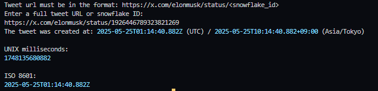

# I was bored, had nothing to do and that is why I made a simple Twitter (X) snowflake to timestamp converter..

## Overview
A simple tool to convert Twitter (X) snowflake IDs to timestamps. Useful for Twitter scrapers or analyzing tweet creation times. This is a minimal implementation for quick use.

## Usage
1. Input a Twitter snowflake ID or tweet URL (supports both x.com and twitter.com).
2. The tool outputs the corresponding timestamp.

## Output
The converter returns a human-readable timestamp (e.g., `2025-05-25T01:14:40.882Z`).

## Alternatives
For a more robust solution, check out:
- [Web version](https://web.usamyon.moe/twi-snow-stamp/)
- [bwmarrin/snowflake](https://github.com/bwmarrin/snowflake) (Go package)

## Notes
- Ensure snowflake IDs are valid.
